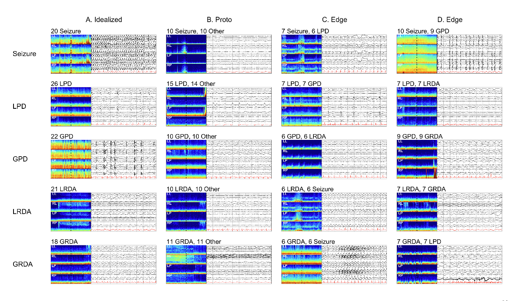

## watch GPU
```bash
watch -n 1 nvidia-smi
```

## improvements
- logging
- resent is overfitting
- wandb experiment tracking
- standardise the loss function on CD's method
- tune hyperparameters (learning rate, batch size, etc)
- explore different models variations
- explore different models
- albumentations
- explore different head/architectures
- explore different optimizers
- harmonise functions where possible: seed, KL_div, cv, split,
- try to get CD's efficient approach to work in Torch

## ensemble
- efficientnet
- resnet
- lgbm or catboost
- waveform

# kaggle_hms_harmful_brain_activity
From stethoscopes to tongue depressors, doctors rely on many tools to treat 
their patients. Physicians use electroencephalography with critically ill 
patients to detect seizures and other types of brain activity that can cause 
brain damage. You can learn about how doctors interpret these EEG signals in 
these videos:

EEG Talk - ACNS Critical Care EEG Terminology 2021
- [Part 1](https://www.youtube.com/watch?v=S9NLrhj0x-M&t)
- [Part 2](https://www.youtube.com/watch?v=4D9R2WIKr-A)
- [Part 3](https://www.youtube.com/watch?v=-R5yUX7p_j4)
- [Part 4](https://www.youtube.com/watch?v=OknS2ObD9-g&t)
- [Part 5](https://www.youtube.com/watch?v=2c7ABQRkn3s)

Currently, EEG monitoring relies solely on manual analysis by specialized 
neurologists. While invaluable, this labor-intensive process is a major 
bottleneck. Not only can it be time-consuming, but manual review of EEG 
recordings is also expensive, prone to fatigue-related errors, and suffers 
from reliability issues between different reviewers, even when those reviewers 
are experts.

Competition host Sunstella Foundation was created in 2021 during the COVID 
pandemic to help minority graduate students in technology overcome challenges 
and celebrate their achievements. These students are vital to America's 
technology leadership and diversity. Through workshops, forums, and 
competitions, the Sunstella Foundation provides mentorship and career advice 
to support their success.

Sunstella Foundation is joined by Persyst, Jazz Pharmaceuticals, and the 
Clinical Data Animation Center (CDAC), whose research aims to help people 
preserve and enhance brain health.

Your work in automating EEG analysis will help doctors and brain researchers 
detect seizures and other types of brain activity that can cause brain damage, 
so that they can give treatments more quickly and accurately. The algorithms 
developed in this contest may also help researchers who are working to develop 
drugs to treat and prevent seizures.

There are six patterns of interest for this competition: 
1. seizure (SZ), 
2. generalized periodic discharges (GPD), 
3. lateralized periodic discharges (LPD), 
4. lateralized rhythmic delta activity (LRDA), 
5. generalized rhythmic delta activity (GRDA), 
6. or “other”. 
7. Detailed explanations of these patterns are available [here](https://www.acns.org/UserFiles/file/ACNSStandardizedCriticalCareEEGTerminology_rev2021.pdf)

The EEG segments used in this competition have been annotated, or classified, 
by a group of experts. In some cases experts completely agree about the correct 
label. In other cases the experts disagree. We call segments where there are 
high levels of agreement “idealized” patterns. Cases where ~1/2 of experts give 
a label as “other” and ~1/2 give one of the remaining five labels, we call 
“proto patterns”. Cases where experts are approximately split between two of 
the five named patterns, we call “edge cases”.

### Examples of EEG Patterns with Different Levels of Expert Agreement:


*Please refer to Data tab for full screen PDF page of each subfigure*

This figure shows selected examples of EEG patterns with different level of 
agreement. Rows are structured with the 1st row seizure, 2nd row LPDs, 3rd row 
GPDs, 4th row LRDA, and 5th row GRDA. Column-wise, examples of idealized forms 
of patterns are in the 1st column (A). These are patterns with uniform expert 
agreement. The 2nd column (B) are proto or partially formed patterns. About 
half of raters labeled these as one IIIC pattern and the other half labeled 
“Other”. The 3rd and 4th columns (C, D) are edge cases (about half of raters 
labeled these one IIIC pattern and half labeled them as another IIIC pattern).

For B-1 there is rhythmic delta activity with some admixed sharp discharges 
within the 10 second raw EEG, and the spectrogram shows that this segment may 
belong to the tail end of a seizure, thus disagreement between SZ and “Other” 
makes sense. B-2 shows frontal lateralized sharp transients at ~1Hz, but they 
have a reversed polarity, suggesting they may be coming from a non-cerebral 
source, thus the split between LPD and “Other” (artifact) makes sense. B-3 has 
diffused semi-rhythmic delta background with poorly formed low amplitude 
generalized periodic discharges with s shifting morphology making it a 
proto-GPD type pattern. B-4 shows semi-rhythmic delta activity with unstable 
morphology over the right hemisphere, a proto-LRDA pattern. B-5 shows a few 
waves of rhythmic delta activity with an unstable morphology and is poorly 
sustained, a proto-GRDA. C-1 shows 2Hz LPDs showing an evolution with 
increasing amplitude evolving underlying rhythmic activity, a pattern between 
LPDs and the beginning of a seizure, an edge-case. D-1 shows abundant GPDs on 
top of a suppressed background with frequency of 1-2Hz. The average over the 
10-seconds is close to 1.5Hz, suggesting a seizure, another edge case. C-2 
is split between LPDs and GPDs. The amplitude of the periodic discharges is 
higher over the right, but a reflection is also seen on the left. D-2 is tied 
between LPDs and LRDA. It shares some features of both; in the temporal 
derivations it looks more rhythmic whereas in the parasagittal derivations it 
looks periodic. C-3 is split between GPDs and LRDA. The ascending limb of the 
delta waves have a sharp morphology, and these periodic discharges are seen 
on both sides. The rhythmic delta appears to be of higher amplitude over the 
left, but there is some reflection of the activity on the left. D-3 is split 
between GPDs and GRDA. The ascending limb of the delta wave has a sharp 
morphology and there is asymmetry in slope between ascending and descending 
limbs making it an edge case. C-4 is split between LRDA and seizure. It shows 
2Hz LRDA on the left, and the spectrogram shows that this segment may belong 
to the tail end of a seizure, an edge-case. D-4 is split between LRDA and 
GRDA. The rhythmic delta appears to be of higher amplitude over the left, 
but there is some reflection of the activity on the right. C-5 is split 
between GRDA and seizure. It shows potentially evolving rhythmic delta 
activity with poorly formed embedded epileptiform discharges, a pattern 
between GRDA and seizure, an edge-case. D-5 is split between GRDA and LPDs. 
There is generalized rhythmic delta activity, while the activity on the right 
is somewhat higher amplitude and contains poorly formed epileptiform 
discharges suggestive of LPDs, an edge-case. Note: Recording regions of the 
EEG electrodes are abbreviated as 
- LL = left lateral; 
- RL = right lateral; 
- LP = left parasagittal; 
- RP = right parasagittal.

# Evaluation
Submissions are evaluated on the [Kullback Liebler divergence](https://www.kaggle.com/code/metric/kullback-leibler-divergence/notebook) between the 
predicted probability and the observed target.

## Data

## Setup
### 1. Download and install the data
download competition data
```bash
mkdir data
cd data
kaggle competitions download -c hms-harmful-brain-activity-classification
```

unzip competition data then remove zip file
```bash
cd data
unzip hms-harmful-brain-activity-classification.zip && rm hms-harmful-brain-activity-classification.zip
```

